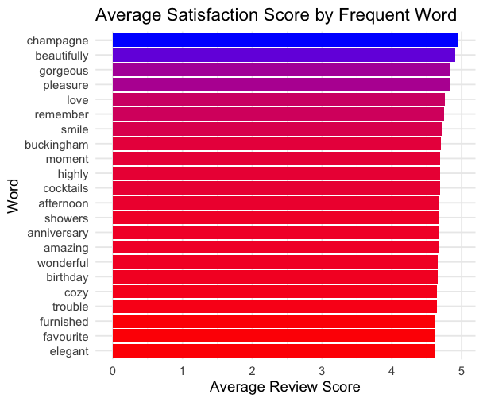
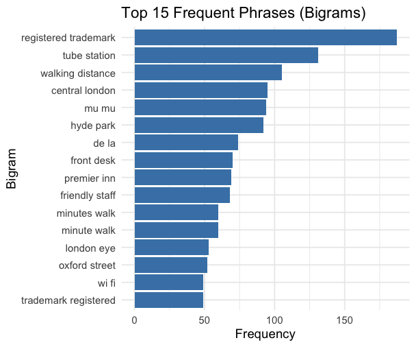
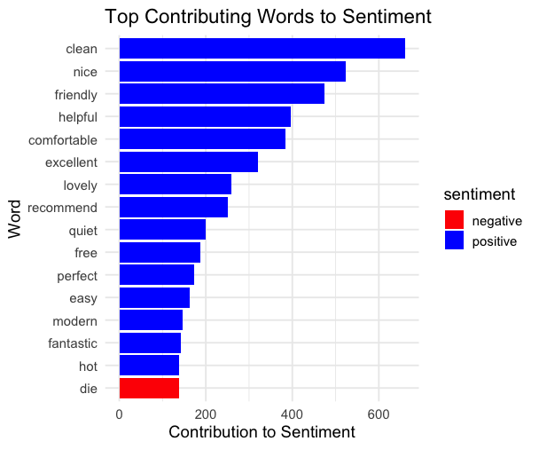
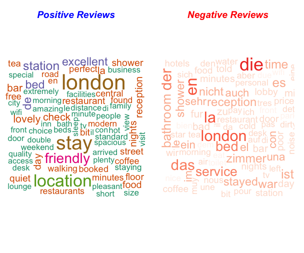
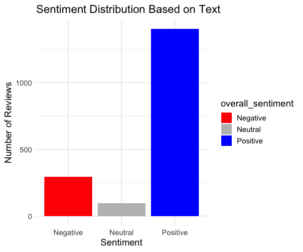
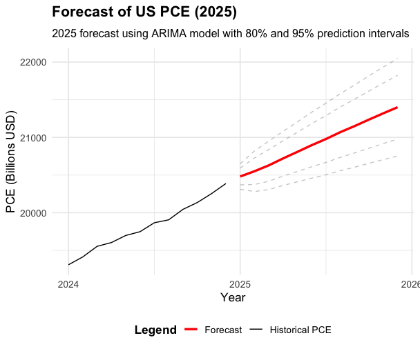
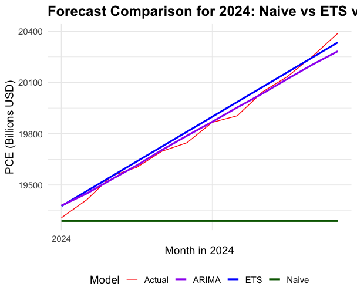
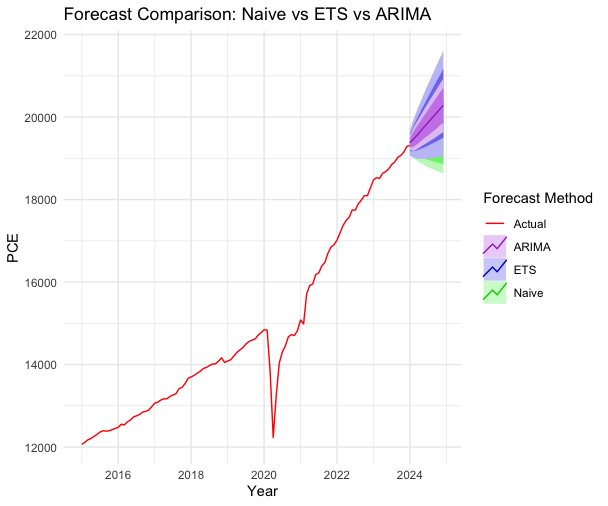

# Forecasting & Sentiment Analysis — MSc Project (University of Leeds)

> **Tech stack:** R (forecast, ggplot2, tidyverse, tidytext)  
> **Topics:** Time-series forecasting (ARIMA/ETS/Naïve), NLP sentiment analysis (AFINN/BING)

## Overview
This project combines **time-series forecasting** and **text-based sentiment analysis** to inform **economic planning** and **customer insights**.

- **Forecasting:** US Personal Consumption Expenditure (1959–2025) using Naïve, ETS, ARIMA.  
- **Sentiment:** Analysis of 2,000 hotel reviews to identify satisfaction drivers.

## Methods
- **Forecasting:** `auto.arima()`, ETS, Naïve; residual diagnostics; accuracy via **MAPE/MAE/RMSE**.  
- **NLP:** Tokenisation, stopwords, **BING/AFINN** lexicons, bigrams, wordclouds.  
- **R packages:** `forecast`, `tseries`, `ggplot2`, `zoo`, `tidyverse`, `tidytext`, `textdata`, `tm`, `wordcloud`.

## Results
- **ARIMA** outperformed baselines with **MAPE < 0.2%** (2024 test).  
- 2025 PCE forecast shows **~5.2%** YoY growth.  
- Reviews are mostly **positive**; top drivers: *clean*, *friendly*, *location*, *helpful*, *modern*.

## How to Run (R)
```r
# install.packages(c("forecast","tseries","ggplot2","tidyverse","tidytext","textdata","tm","wordcloud","zoo"))

# ---- Forecasting ----
library(forecast); library(tseries); library(ggplot2); library(zoo)
pce <- read.csv("data/PCE.csv")
pce_ts <- ts(pce$PCE, start=c(1959,1), frequency=12)
fit <- auto.arima(pce_ts); fc <- forecast(fit, h=12); autoplot(fc)

# ---- Sentiment ----
library(tidyverse); library(tidytext); library(tm); library(wordcloud)
reviews <- read.csv("data/HotelsData.csv")
# See code/nlp_sentiment.R for the full pipeline
```

## Visuals

### Sentiment






### Forecasting





## Repo
```
.
├── code/                 # R scripts (full)
├── data/                 # CSVs used by scripts
├── outputs/              # images referenced above
├── docs/                 # one_pager.md
├── .gitignore
└── README.md
```

**Author:** Yugal Soni · MSc Business Analytics & Decision Science · University of Leeds
